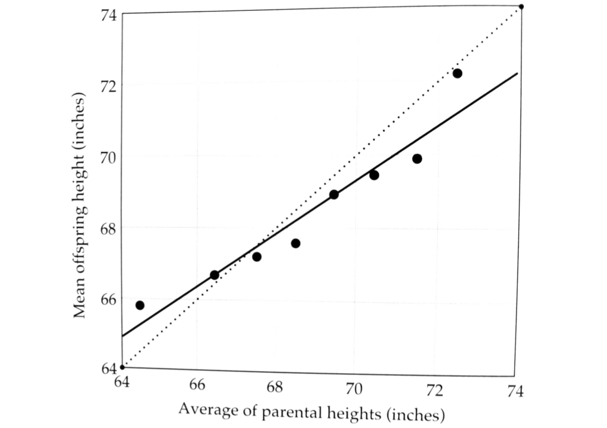
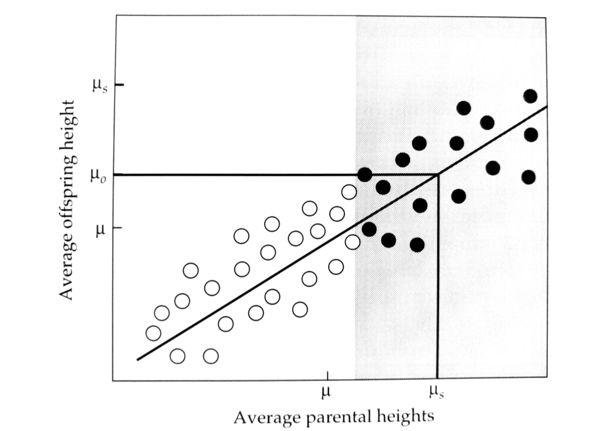
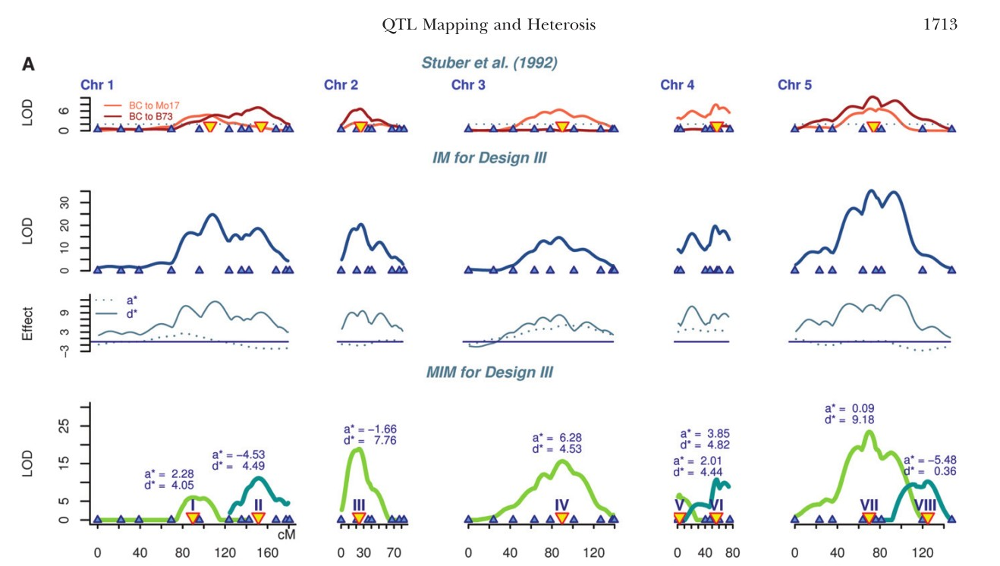
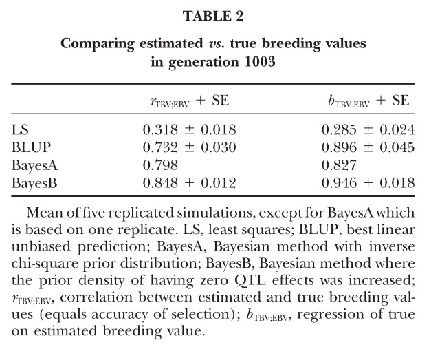

# Quantitative Genetics

## Introduction

<small>
Instructor: [A Augusto F Garcia](http://about.me/augusto.garcia)
/ [Statistical Genetics Lab](http://statgen.esalq.usp.br) </small>

<small>Department of Genetics, Luiz de Queiroz College of Agriculture,
University of São Paulo (Brazil)</small>

*** =pnotes

Some notes on the first slide

---

# Content

## (Lynch & Walsh Book)

### Quantitative Traits
### Seminal Papers
### History
### Major Goals

---

# Quantitative Traits

  - Metric nature
  - Controled by many genes
  - Polygenic, multifactorial
  - Strong influence of environment
  - Statistical methods (Statistical Genetics)
  - Examples: grain yield, disease resistance, fitness,...

---

# Seminal Papers

  - Fisher (1918)
    - Variance decomposition
    - ANOVA
    - (Experimental design, likelihood, evolution,...)
  - Wright (1921)
    - Path Analysis
  - Cockerham (1954)
    - Epistasis (orthogonal decomposition)

---

# History

## Early Ideas
  - Mendel
  - Darwin (1859)
  - Galton (1889): regression toward mediocrity
  - Pearson (1903)
    - Interpretation of Galton's
    - Response to selection
    - Linear regression

---

## Galton e Pearson

---

## Galton e Pearson

---

# Early Days

  - Shull (1908)
    - Genetic uniformity decreases variability (so, traits must have a
      genetic basis)
  - Ehle (1909)
    - Segregation of three loci (large variability)
  - Johannsen (1903, 1909)
    - Genotype and Phenotype
    - Environmental influence on quantitative traits

---

# Modern technologies

## Quantitative Trait Loci (QTL)
## Genomic Selection

---

## QTL

---

## GS

---

# (Some) Goals of Quantitative Genetics

  - Estimate the proportion of phenotypic variation explained by
    genetic causes
  - Consequences of inbreeding and heterosis
  - Correlated responses to selection
  - Breeding values
  - Predict (or explain) genetic gains

---

# Homework

  - Read Chapter 1 of Lynch and Walsh Book
