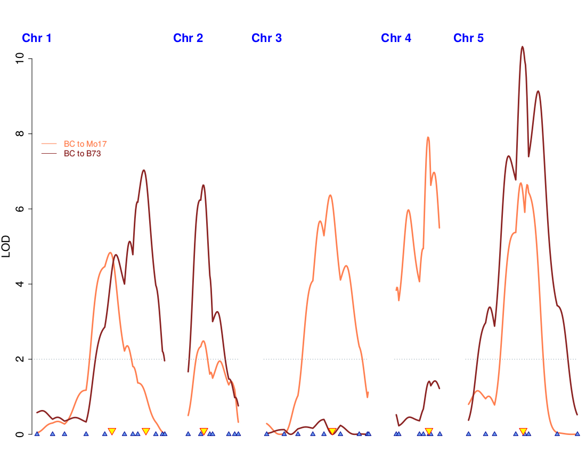
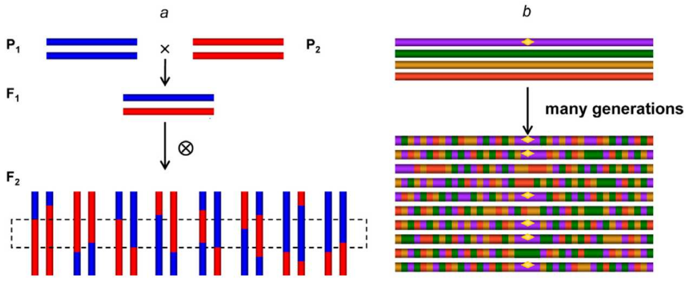
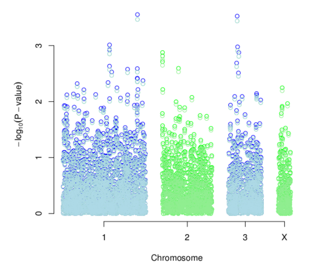
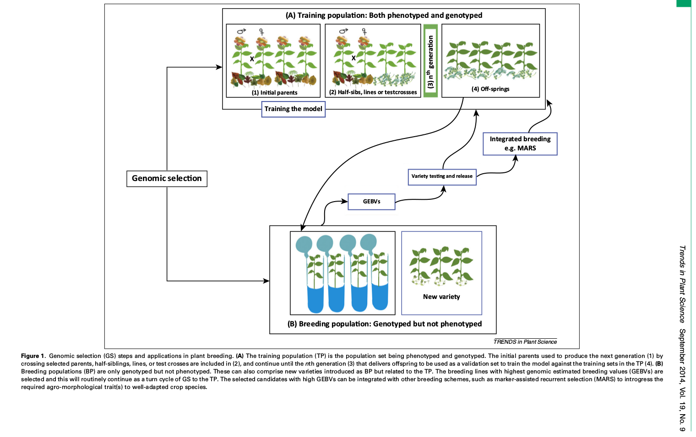

# Quantitative Genetics

## Quantitative Trait Loci (QTL) Mapping, Genome-wide Association Studies (GWAS), Genomic Selection (GS)

<small>
Instructor: [A Augusto F Garcia](http://about.me/augusto.garcia)
/ [Statistical Genetics Lab](http://statgen.esalq.usp.br) </small>

<small>Department of Genetics, Luiz de Queiroz College of Agriculture,
University of São Paulo (Brazil)</small>

*** =pnotes

Some notes on the first slide

---

# Content

### QTL Mapping
### GWAS
### GS

---

# QTL Mapping

- $F_2$ maize population, grain yield

[1,] 6.25 2 1 0 0 0 0 0 1 1 1 0 0

[2,] 3.00 1 1 1 1 1 2 2 2 2 0 0 1

[3,] 3.00 1 2 2 2 2 1 1 1 1 2 2 2

[4,] 4.00 1 0 0 0 0 0 0 0 0 1 2 2

[5,] 3.00 0 0 1 1 1 1 1 1 1 1 1 1

$\ldots$

[171,] 5.75 2 2 1 1 0 1 1 1 1 0 0 0

---

$$y_j = \mu + \beta_1 x_{1j} + \beta_2 x_{2j} + \varepsilon_j$$

- $y_j$: phenotypic value for individual $j$
- $\mu$: intercept
- $x_{1j} = 1$ for $M_iM_i$
- $x_{1j} = 0$ for $M_im_i$
- $x_{1j} = -1$ for $m_im_i$
- $x_{2j} = -1/2$ for $M_iM_i$
- $x_{2j} = +1$ for $M_im_i$
- $x_{2j} = -1/2$ for $m_im_i$
- $\beta_1$: coefficient for additive effects
- $\beta_2$: coefficient for dominance effects
- $\varepsilon_j \thicksim N(0,\;\sigma^2)$

---

## Example

- Not an $F_2$, but only to show how the graphics would look like

---

| Chromosome | Marker | LOD | $r^2$ | Additive Effect |
| --- | -------- | ------ | ------ | -----:|
| 1 | NPI255 | 6,91 | 15,1 | 10,40 |
| 2 | NPIB1  | 6,63 | 13,3 |  9,72 |
| 5 | Amp3   | 9,73 | 18,0 | 11,30 |
| 7 | NPI216 | 4,44 |  8,8 |  7,98 |
| 9 | NPI427 | 4,80 | 10,3 |  8,70 |
|10 | NPI264 | 3,16 |  6,2 |  6,52 |

---

# GWAS

---

---

# Genomic Selection

- Markers in LD with QTL
- Relationship between individuals

---

--- ds:indigo

# Homework

  - Relax! Have a beer!
