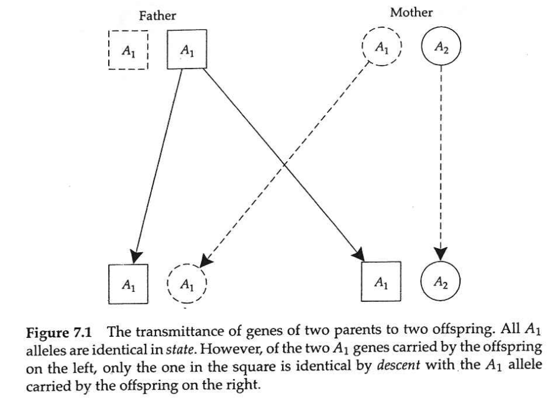
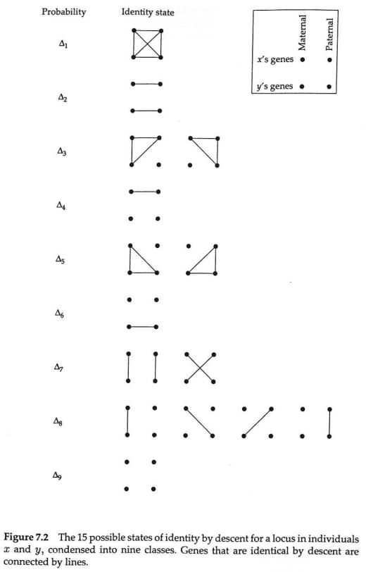
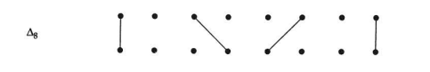
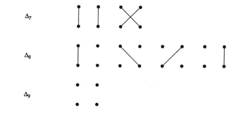
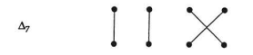
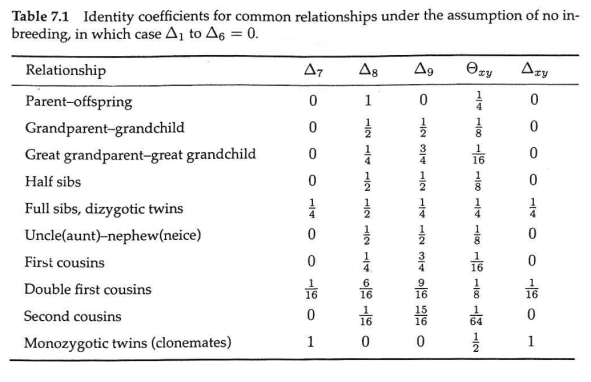
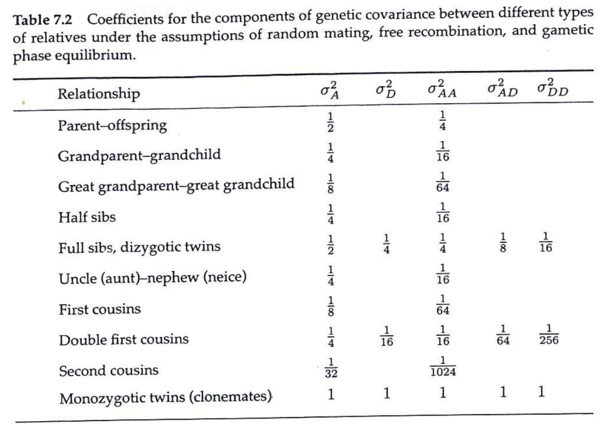

# Quantitative Genetics

## Resemblance Between Relatives

<small>
Instructor: [A Augusto F Garcia](http://about.me/augusto.garcia)
/ [Statistical Genetics Lab](http://statgen.esalq.usp.br) </small>

<small>Department of Genetics, Luiz de Queiroz College of Agriculture,
University of São Paulo (Brazil)</small>

*** =pnotes

Some notes on the first slide

---

# Content

### Introduction
### Measures of Relatedness
### The Genetic Covariance Between Relatives
### The Heritability Concept

---

# Introduction

- Assuming no $G \times E$
- $x$ and $y$: members of a particular relationship (such as
  half-sibs, full-sibs, etc)
- Phenotypes:
$$z_x=G_x+E_x+e_x$$
$$z_y=G_y+E_y+e_y$$
- The phenotypic covariance between relatives $x$ and $y$ is
$$\sigma_z(x,y)=\sigma[(G_x+E_x+e_x),(G_y+E_y+e_y)]$$
$$\phantom{AAAAAAAAAa}=\sigma_G(x,y)+\sigma_{G,E}(x,y)+\sigma_{G,E}(y,x)+\sigma_E(x,y)$$
- Assuming no genotype-environment covariance
$$\sigma_z(x,y)=\sigma_G(x,y)+\sigma_E(x,y)$$

> $\sigma_G(x,y)$ is a natural consequence of relatives inheriting
> copies of the same genes

---

# Measures of Relatedness

- Relatedness is defined in terms of an specific frame of reference
- **_Identity by descent_**: genes _ibd_ are direct descendants of a
  specific gene carried by some ancestor
- **_Identity in state_**: identical genes, but not coming from an
  common ancestor
- **_Inbred_**: individuals that contain pairs of alleles that are
  _ibd_
- There are 15 possible configurations of identity by descent

---

---

---

- The values for $\Delta$ depends on the relationship between $x$ and
  $y$
- For example, if $x$ is a non-inbred parent (mother or father) and
  $y$ is its non-inbred progeny (parent-offspring relationship),
  $\Delta_8=1$ and all other $\Delta_i=0$

---

- For $x$ and $y$ as non-inbred full-sibs
- $0.5$ probability of receiving the same paternal gene
- $0.5$ probability of receiving the same maternal gene
- $\Delta_7=0.25$
- $\Delta_8=0.50$
- $\Delta_9=0.25$
- All other $\Delta_i$'s are $0$

---

## Coefficient of Coancestry

- Suppose that single genes are drawn randomly from individuals $x$
  and $y$
- The probability that these genes are _ibd_ is the **_coefficient of
  coancestry_** $\Theta_{xy}$

$$\Theta_{xy}=\Delta_1+\frac{1}{2}(\Delta_3+\Delta_5+\Delta_7)+\frac{1}{4}\Delta_8$$

---

## Coefficient of Inbreeding

- Assume now that we have an offspring $z$ from $x$ and $y$
- $\Theta_{xy}$ is the probability that the two genes at a locus in
  $z$ are identical by descent
- This is Wright's (1922) **_inbreeding coefficient_** $f_z$
- Notice that $f_z$, next generation, is equivalent to $\Theta_{xy}$,
  previous generation
$$f_z=\Theta_{xy}$$

---

### Some useful derivations

- Individual with itself
$$\Theta_{xx}=\frac{1}{2}(1+f_x)$$
- Parent-offspring
$$\Theta_{po}=\frac{1}{4}(1+f_p+2f_o)$$
- Full-sibs in general ($m$: mother, $f$: father)
$$\Theta_{xy}=\frac{1}{8}(2+f_m+f_f+4\Theta_{mf})$$
- Full-sibs, random mating
$$\Theta_{xy}=\frac{1}{4}$$

---

## Coefficient of Fraternity

- The probability that single-locus genotypes (both genes) of two
  individuals are _ibd_
- Notation: mothers of $x$ and $y$ are $m_x$ and $m_y$, fathers are
  $f_x$ and $f_y$
- Therefore:
$$\Delta_{xy}=\Theta_{m_xm_y}\Theta_{f_xf_y}+\Theta_{m_xf_y}\Theta_{f_xm_y}$$
- This is the same of
$$\Delta_{xy}=\Delta_1+\Delta_7$$
- (No inbreeding, $\Delta_{xy}=\Delta_{7}$)

---

---

# The Genetic Covariance Between Relatives

- First, let us make a number of assumptions, including
  - Diploid, autosomal loci
  - Random mating
  - No linkage disequilibrium
  - No $G \times E$ and no covariance $G,E$
- Then, let us take two individuals in a
  population where all members have the same relationship

---

$$G_{ijkl..}(x)=\mu_G+[\alpha^x_i+\alpha^x_j+\alpha^x_k+\alpha^x_l+...]+[\delta^x_{ij}+\delta^x_{kl}+...]$$

$$\phantom{AAAAAA}+[(\alpha\alpha)^x_{ik}+(\alpha\alpha)^x_{il}+(\alpha\alpha)^x_{jk}+(\alpha\alpha)^x_{jl}+...]$$

$$\phantom{AAAAAAAAAA}+[(\alpha\delta)^x_{ikl}+(\alpha\delta)^x_{jkl}+(\alpha\delta)^x_{kij}+(\alpha\delta)^x_{lij}+...]+(\delta\delta)^x_{ijkl}+...$$

$$\phantom{ZZZ}$$

$$G_{ijkl..}(y)=\mu_G+[\alpha^y_i+\alpha^y_j+\alpha^y_k+\alpha^y_l+...]+[\delta^y_{ij}+\delta^y_{kl}+...]$$

$$\phantom{AAAAAA}+[(\alpha\alpha)^y_{ik}+(\alpha\alpha)^y_{il}+(\alpha\alpha)^y_{jk}+(\alpha\alpha)^y_{jl}+...]$$

$$\phantom{AAAAAAAAAA}+[(\alpha\delta)^y_{ikl}+(\alpha\delta)^y_{jkl}+(\alpha\delta)^y_{kij}+(\alpha\delta)^y_{lij}+...]+(\delta\delta)^y_{ijkl}+...$$

---

- Fisher (1918) showed that
$$\sigma_G(x,y)=\sigma_A(x,y)+\sigma_D(x,y)+\sigma_{AA}(x,y)+\sigma_{AD}(x,y)+\sigma_{DD}(x,y)+...$$
- This is so because the genetic effects are uncorrelated within
  individuals (as discussed before) and also between individuals

---

- The covariance between $x$ and $y$ caused by **additive effects** is
$$E[(\alpha^x_i+\alpha^x_j)(\alpha^y_i+\alpha^y_j)]$$
    - $E(\alpha^x_i\alpha^y_i)$ is one of the terms
    - The only way this expectation is not zero is if allele $i$ is
      the same in individuals $x$ and $y$
    - If this happens, $E(\alpha^x_i\alpha^y_i)=E(\alpha^2_i)$ (half
      the additive genetic variance)
    - But the probability of $i$ being the same is $\Theta_{xy}$
    - With the same reasoning for the four terms, we have that the
    expectation is 
    $$4\Theta_{xy}E(\alpha^2_i)$$ 
    (twice the additive genetic variance for this loci times $\Theta_{xy}$)

--- ds:blue

### Additive Genetic Covariance

- By summing over loci

$\phantom{ZZ}$

$$\sigma_A(x,y)=2\Theta_{xy}\sigma^2_A$$

---

### Dominance Genetic Covariance

- $E(\delta^x_{ij}\delta^y_{ij})$
- If $x$ and $y$ are _ibd_ for both genes at this locus, then
$$E(\delta^x_{ij}\delta^y_{ij})=E(\delta^2_{ij})$$
- This is the dominance genetic variance
- This identity has probability $\Delta_{xy}$
- For all loci
$$\sigma_D(x,y)=\Delta_{xy}\sigma^2_D$$

---

### Epistatic Genetic Covariance

- Using the same reasoning, it is possible to show that
$$\sigma_{AA}(x,y)=(2\Theta_{xy})^2\sigma^2_{AA}$$

--- ds:blue

## Covariance Between Relatives

$$\phantom{ZZ}$$

$$\sigma_G(x,y)=2\Theta_{xy}\sigma^2_A+\Delta_{xy}\sigma^2_D+(2\Theta_{xy})^2\sigma^2_{AA}$$
$$\phantom{ZZ}$$
$$\phantom{AAAAAAAAAAAA}+2\Theta_{xy}\Delta_{xy}\sigma^2_{AD}+\Delta^2_{xy}\sigma^2_{DD}+(2\Theta_{xy})^3\sigma^2_{AAA}+...$$

---

- This can be used to estimate variance components based on
  covariances

---

# The Heritability Concept

- The ratio $\frac{\sigma^2_A}{\sigma^2_z}$ is known as the
  **narrow-sense heritability**
- This is an attempt to have a parameter that describes the genetic
  resemblance between parents and offspring
- But notice that the expression for genetic covariance between
  relatives has the term $2\Theta_{xy}\sigma^2_A$
- Thus, under the assumption that the additive genetic variance is the
  most important source of phenotypic covariance:
$$h^2\simeq\frac{Cov(z_x,z_y)}{2\Theta_{xy}Var(z)}$$
- This is a good approximation to the heritability

--- ds:indigo

# Homework

  - Read Chapter 7 of Lynch and Walsh Book
